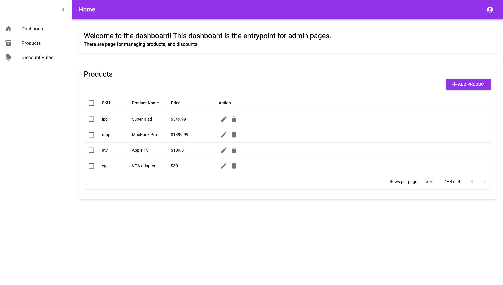
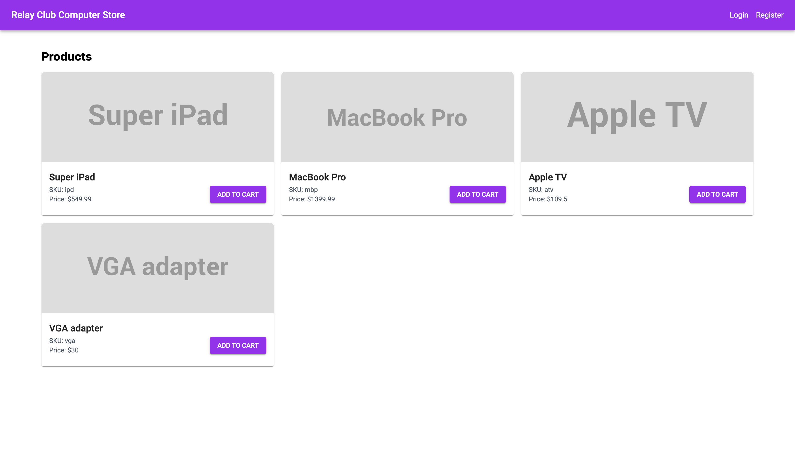

# Coding Assessment

This project using NestJS + Supabase and NextJS built using monorepo architecture

## Running Application In Dev Mode

1. create .env file in app/backend folder from the .env.example

   ```
   yarn docker-compose:dev up -d
   ```

   Make sure all service has running
   

2. create .env file in app/backend folder from the .env.example

   ```
   cp app/backend/.env.example app/backend/.env
   ```

3. create .env file in app/frontend folder from the .env.example

   ```
   cp app/frontend/.env.example app/frontend/.env
   ```

4. start the application

   ```
   yarn start:all:dev
   ```

5. Open the application on http://localhost:1321, http://localhost:3000 for backend app and frontend app respectively

# Swagger UI

Open your browser and go to http://localhost:1321/api-docs

You can try APIs on Swagger UI. Some of APIs using bearer token after authenticating user through login endpoint.


# Running App In Production Mode

### Running Database

```
yarn docker-compose:prod up -d
```

Make sure all service has running


### Build Backend app

```
yarn build:backend

```

### Build Frontend app

```
yarn build:frontend
```

### Start application concurrently

```
yarn start:all:prod
```

# Demo User Auth

### Shop Owner

```
username: admin
password: admin
```

### Buyer

```
username: buyer
password: buyer
```

# Generate Docker Image

## Backend

```

yarn build:backend:docker

```

## Frontend

```
yarn build:frontend:docker

```

# Screenshots








# Tests


